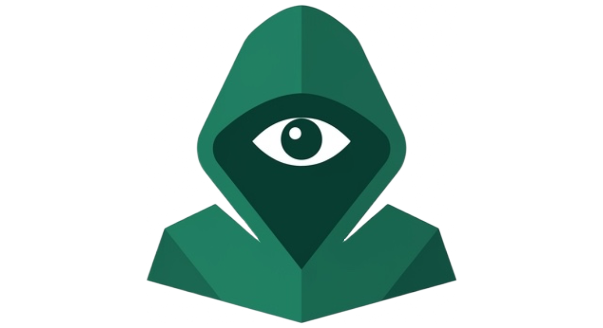

<div align="center">


<h1>camougg</h1>
<p><em>A terminal-based tool for hiding files inside ordinary-looking media — and getting them back</em></p>

  <p>
    <a href="https://github.com/m000gg/camougg/issues"></a>
    <a href="https://github.com/m000gg/camougg/network/members"></a>
    <a href="LICENSE"></a>
  </p>

</div>

---

## Contents
* *[About this project](#about-this-project)*
* *[Use Cases](#use-cases)*
* *[Target Users](#target-users)*
* *[Problem Statement](#problem-statement)*
* *[Features](#features)*
* *[App Screenshots](#-app-screenshots)*
* *[Project Structure](#project-structure)*
* *[Architecture Overview](#architecture-overview)*
* *[Technology Stack](#technology-stack)*
* *[Development Principles](#development-principles)*
* *[Getting Started](#-getting-started)*
* *[Configuration](#configuration)*
* *[Authors](#-authors)*
* *[Questions](#questions)*
* *[License](#license)*

---

## About this project
**camougg** is a terminal user interface (TUI) tool for steganographically hiding arbitrary files inside multimedia containers, and extracting them back losslessly. A payload (a document, an archive, any binary data) is embedded into an ordinary-looking image so it can be shared or stored without drawing attention, and optionally protected with a password before it's embedded. The MVP focuses on image containers, with audio and video support planned for later releases.

---

## Use Cases

|                      Private file sharing                                                   |                Plausible-looking storage                                      |            Personal experimentation                         |
|:-------------------------------------------------------------------------------------------:|:-----------------------------------------------------------------------------:|:-----------------------------------------------------------:|
| Send a hidden file inside a normal-looking photo, instead of an obviously encrypted archive | Store sensitive data inside a media file that doesn't look suspicious at rest | Learn and experiment with steganography techniques hands-on |

---

## Target Users
This project is aimed at developers, privacy-conscious users, and anyone curious about steganography who wants a simple, scriptable, terminal-first way to hide and recover files inside media — without relying on a GUI tool or an online service that would require uploading sensitive data to a third party.

---

## Problem Statement
Most existing steganography tools are either outdated GUI applications, unmaintained academic projects, or web tools that require uploading your files to someone else's server — a non-starter if the whole point is keeping the payload private. There's a lack of simple, modern, terminal-based tools that let you embed and recover arbitrary files locally, with password protection, and a pleasant interactive interface. camougg aims to fill that gap, starting with image containers and expanding to audio and video.

---

## Features
* **File embedding**: hide any file inside a PNG or JPEG image using LSB steganography.
* **Lossless extraction**: recover the original file byte-for-byte from a carrier image.
* **Password protection**: encrypt the payload before embedding it.
* **Interactive TUI**: guided, keyboard-driven interface (built with Textual) — no need to memorize flags.
* **Local-first**: everything runs on your machine, nothing is uploaded anywhere.

---

## 📸 App Screenshots

> Screenshots will be added here once the TUI is finalized.

|                    Embed flow                    |                     Extract flow                     |
|:------------------------------------------------:|:----------------------------------------------------:|
|   |   |

*(placeholders — replace with actual captures under `docs/screenshots/` once available)*

---

## Project Structure

> The structure below reflects the current MVP scope and will evolve as audio/video support is added.

```text
camougg/
├─ src/
│  └─ camougg/
│     ├─ core/                              ← steganography engine (embed/extract, LSB logic)
│     ├─ crypto/                            ← payload encryption/decryption (password-based)
│     ├─ formats/                           ← per-container-format handling (PNG, JPEG)
│     ├─ tui/                               ← Textual-based interactive interface
│     ├─ __init__.py
│     └─ __main__.py                        ← CLI entry point
├─ docs/                                    ← documentation, screenshots
│  ├─ features/                             ← features description & explanation
│  ├─ logo.png                              ← project logo used in this README
│  └─ screenshots/                          ← app screenshots used in this README
├─ tests/                                   ← unit tests
├─ pytest.ini
├─ pyproject.toml                           ← project metadata and dependencies
└─ README.md                                ← project description and instructions 
```

---

## Architecture Overview
camougg is a single-package Python CLI/TUI application. The core steganography engine is kept independent from the interface layer, so the same embed/extract logic can eventually be driven by the TUI, a future scripting API, or additional container-format modules (audio, video) without rewriting the core.

---

## Technology Stack
| Category         | Technologies            |
|------------------|-------------------------|
| Language         | Python                  |
| TUI              | Textual                 |
| Image processing | Pillow (planned/likely) |
| Packaging        | pip / PyPI (TBD)        |
| Version Control  | Git, GitHub             |

---

## Development Principles

| Practice                  | Implementation                                                                                                           |
|---------------------------|--------------------------------------------------------------------------------------------------------------------------|
| **MVP-first**             | Image support (PNG/JPEG) ships first; audio and video are deliberately deferred.                                         |
| **Local-first & private** | No network calls, no telemetry — all processing happens on the user's machine.                                           |
| **Lossless correctness**  | Extraction must reproduce the original payload byte-for-byte; this is treated as a hard requirement, not a nice-to-have. |

---

## ⚡ Getting Started

### 1) Clone the repo

```bash
git clone https://github.com/m000gg/camougg.git
cd camougg
```

### 2) Requirements

- Python 3.10+

### 3) Installation

> Installation instructions will be finalized closer to the MVP release (planned via `pip`/PyPI).

```bash
pip install -e .
```

### 4) How to Use

```bash
python -m camougg
```

Launches the interactive TUI, where you can choose:
- a carrier image
- a file to embed
- an optional password
- the mode: embed or extract

*(this section will be expanded with concrete commands and screenshots once the interface is finalized)*

---

## Configuration

No external configuration is required — camougg is a self-contained local tool.

---

## 👥 Authors

* **m000gg** — *Core Development* — [GitHub](https://github.com/m000gg)

---

## Questions?

Open an Issue in this repo with a short description and steps to reproduce.
For general questions or networking, see contact links in my overview [profile](https://github.com/m000gg "m000gg profile").

## License
This project is licensed under the [MIT License](LICENSE).