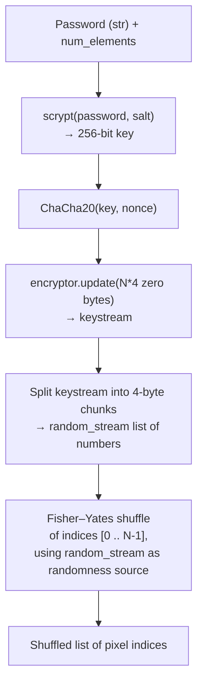
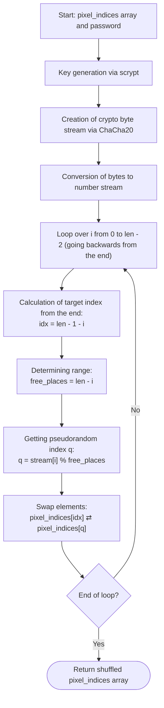

# Feature #1: Cryptographical Secure Pseudorandom Number Generator

---
## Changelog
| Version | Date       | Description         | Authors                             |
|---------|------------|---------------------|-------------------------------------|
| 1.0     | 2026-07-31 | Initial Description | [m000gg](https://github.com/m000gg) |
---

- Issue #3➔ PR #2

## 👔Part 1: Product & Business

### Executive Summary
`CSPRNGenerator.hash_password` turns a user's password into a deterministic, but
unpredictable-without-the-password, permutation of pixel indices in the container.
It's needed so that the order in which the payload is embedded into pixels depends
on the password: without the correct password, reconstructing the embedding order
(and thus extracting the hidden data) is practically infeasible.

### Feature objectives
- Generate a permutation of `num_elements` indices in deterministic time that depends
  only on the password and the element count (no disk/network access).
- Guarantee that the same password + `num_elements` always produce the same
  permutation (required for both embedding and extraction).
- Provide cryptographic resistance to password brute-forcing / dictionary attacks by
  making key derivation expensive.

### Feature scope
**In scope:**
- Key derivation from the password via `scrypt`.
- Pseudorandom byte stream generation from the key via `ChaCha20`.
- Building an index permutation `[0 .. num_elements-1]` using the Fisher–Yates
  algorithm.

**Out of scope (outside this function):**
- The actual bit embedding/extraction logic into pixels.
- Password strength validation.
- Managing/storing the salt and nonce (currently static, see Open Questions).

### User flow



### Use cases
1. **Embedding data**: user enters a password → the function returns a pixel order →
   the payload is written in that order.
2. **Extraction with the correct password**: same password and same `num_elements` →
   the function deterministically returns the same order → the payload is read back
   correctly.
3. **Extraction with the wrong password**: a different password → a different key →
   a different keystream → a different permutation → the payload cannot be recovered
   (looks like noise).
4. **Different container sizes**: `num_elements` ranges from small images to very
   large ones — the function must stay fast and preserve the properties above.

### Functional Requirements
- The function accepts `password: str` and `num_elements: int`, returns
  `list[int]` — a permutation of `0 .. num_elements-1`.
- For identical `(password, num_elements)` the result is always identical
  (determinism).
- For different passwords the results are statistically indistinguishable (look like
  independent random permutations).
- Every index in the range appears in the result exactly once (a valid permutation,
  no duplicates or gaps).

### Non-Functional Requirements
- Key derivation must be resistant to offline password brute-forcing
  (memory-hard KDF).
- The randomness source must be cryptographically strong (not `random` /
  Mersenne Twister, but a cipher-based stream).
- Generation time must remain acceptable for large `num_elements` (linear, no
  quadratic operations).


## 🛠Part 2: Technical Realisation

### Architecture & Integrations

**Tools used:**
- `hashlib.scrypt` — key derivation function (KDF), turns the password into a
  256-bit key.
- `cryptography.hazmat.primitives.ciphers` (`ChaCha20`) — a stream cipher used here
  not to encrypt data, but as a pseudorandom byte-stream generator (CSPRNG), fed
  with zero bytes.
- Fisher–Yates algorithm — for building a uniform index permutation.

**Explanation of the design decisions in the code (step by step):**

1. **`self.static_salt = b"camougg"`** — the salt for `scrypt`. It's hardcoded and
   identical for every user. This is intentional, for determinism: embedding and
   extraction must derive the same key from the same password, and the current
   version has no mechanism to store/transmit a dynamic salt separately. The cost is
   that this salt does not protect against rainbow-table attacks across different
   users the way a per-user salt normally would (see Open Questions).

2. **`self.nonce = b'1234567890123456'`** — a static 16-byte nonce for `ChaCha20`.
   Here `ChaCha20` isn't used to "encrypt a secret" — it's used as a generator of a
   pseudorandom stream that depends on the key. Since the key is already unique per
   password (thanks to `scrypt`), reusing the same nonce across different keys does
   not trigger the classic "nonce reuse" vulnerability, which is specifically
   dangerous when the *same nonce is reused with the same key*.

3. **`hashlib.scrypt(password, salt=..., n=16384, r=8, p=1, dklen=32)`** — key
   derivation from the password. `scrypt` was chosen because it's memory-hard:
   brute-forcing the password requires not just CPU time but memory, which makes
   GPU/ASIC attacks much harder compared to a plain hash (SHA-256, etc.).
   `dklen=32` gives exactly 256 bits — what `ChaCha20` needs as a key.

4. **`Cipher(algorithms.ChaCha20(key, self.nonce), mode=None)`** — creates a
   ChaCha20 cipher on the derived key. `mode=None` because ChaCha20 is a stream
   cipher and doesn't need a separate mode the way block ciphers do.

5. **`encryptor.update(bytes(num_elements * 4))`** — `num_elements * 4` zero bytes
   are fed into the cipher. Since ChaCha20 is a stream cipher, encrypting zeros
   yields a "pure" keystream (result = keystream XOR 0 = keystream). This is a
   standard technique: use a stream cipher as a cryptographically strong random byte
   generator (CSPRNG) rather than as an encryption mechanism. The `* 4` is a direct
   consequence of step 6 below: the loop needs exactly one 32-bit integer per
   element of `pixel_indices`, and each 32-bit integer is built from 4 bytes of
   keystream — so `num_elements` integers require `num_elements * 4` bytes of raw
   keystream up front.

6. **Splitting `raw_bytes` into 4-byte chunks → `int.from_bytes(..., 'little')`** —
   the keystream is turned into a list of 32-bit integers (`random_stream`), used
   next as the randomness source for shuffling. 4 bytes per number matters because
   of the range it provides: a single byte would only cover 256 possible values
   (0–255), but `num_elements` (the pixel count) can easily be in the thousands or
   millions for a real image. If `random_stream[i]` only ranged 0–255 while
   `free_places` was, say, 10,000, then `q = random_stream[i] % free_places` could
   never land above 255 — the shuffle would be severely biased, not just slightly.
   Using 4 bytes gives a range of `0 .. 4,294,967,295` (2³²), which comfortably
   exceeds any realistic `num_elements`, keeping the modulo bias negligible instead
   of catastrophic.

7. **Fisher–Yates loop**:
   ```python
   for i in range(0, len(pixel_indices)-1):
       free_places = len(random_stream) - i
       q = random_stream[i] % free_places
       pixel_indices[len(pixel_indices)-1-i], pixel_indices[q] = \
           pixel_indices[q], pixel_indices[len(pixel_indices)-1-i]
   ```
   This is the classic algorithm for building a uniform random permutation in
   `O(n)`: at each step `i`, a random still-unplaced element (`q`, taken modulo the
   remaining number of free slots) is picked and swapped with the last
   not-yet-fixed element. Each step `i` consumes exactly one number from the
   keystream (`random_stream[i]`) as its randomness source.




### Data models
This function does not create any persistent data or DB models. The only structure
is the input/output contract of the function itself:
- Input: `password: str`, `num_elements: int`.
- Output: `list[int]` of length `num_elements`, a permutation of
  `0 .. num_elements-1`, used by other camougg components as the pixel traversal
  order during embedding/extraction of the payload.

### Open questions
- *Q1*: `static_salt` is identical for every password/user — is this an accepted
  trade-off for determinism, or should the salt instead depend on the
  image/session and be stored separately (e.g., inside the container itself)?
- *Q2*: The static `nonce` is safe as long as the key is unique per password —
  should this be explicitly documented as an invariant that must never be violated
  by future changes?