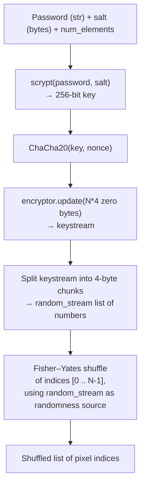
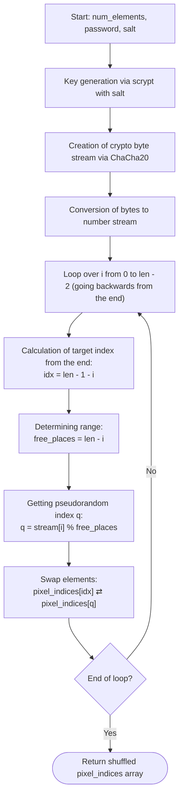

# Feature #1: Cryptographical Secure Pseudorandom Number Generator

---
## Changelog
| Version  | Date       | Description                                                                                                                                                                                         | Authors                             |
|----------|------------|-----------------------------------------------------------------------------------------------------------------------------------------------------------------------------------------------------|-------------------------------------|
| 1.0      | 2026-07-31 | Initial Description                                                                                                                                                                                 | [m000gg](https://github.com/m000gg) |
| 2.0      | 2026-08-21 | MVP2: `static_salt` removed; `hash_password` now accepts a random, per-embed `salt` as a parameter instead of using a hardcoded constant. Salt storage moved to Feature #2 (fixed unpermuted zone). | [m000gg](https://github.com/m000gg) |
---

- Issue #6 ➔ PR #8

## 👔Part 1: Product & Business

### Executive Summary
`CSPRNGenerator.hash_password` turns a user's password **and a salt** into a
deterministic, but unpredictable-without-both, permutation of pixel indices in the
container. It's needed so that the order in which the payload is embedded into
pixels depends on the password: without the correct password (and the salt
recovered from the container), reconstructing the embedding order — and thus
extracting the hidden data — is practically infeasible.

As of v2.0, the salt is no longer a hardcoded constant shared by every user. A
fresh 16-byte salt is generated (`os.urandom(16)`) on every embed and passed into
`hash_password` as an explicit parameter. This is what makes two embeds of the
same file with the same password produce different stego images (see Feature #2,
Decision 3 and Decision 4) — something a static salt could never provide, since a
static salt always derives the same key from the same password.

### Feature objectives
- Generate a permutation of `num_elements` indices in deterministic time that depends
  only on the password, the salt, and the element count (no disk/network access).
- Guarantee that the same `(password, salt, num_elements)` always produce the same
  permutation (required for both embedding and extraction).
- Provide cryptographic resistance to password brute-forcing / dictionary attacks by
  making key derivation expensive.
- Accept the salt as an external input rather than owning it, so callers can
  randomize it per embed without any change to this function.

### Feature scope
**In scope:**
- Key derivation from the password **and a caller-supplied salt** via `scrypt`.
- Pseudorandom byte stream generation from the key via `ChaCha20`.
- Building an index permutation `[0 .. num_elements-1]` using the Fisher–Yates
  algorithm.

**Out of scope (outside this function):**
- The actual bit embedding/extraction logic into pixels.
- Password strength validation.
- Generating the salt itself (`os.urandom(16)`, done by the caller on embed — see
  Feature #2, Decision 3).
- Storing/retrieving the salt to/from the container (the fixed unpermuted salt
  zone — see Feature #2, Decision 3).
- Managing the nonce (currently static — see Open Questions).

### User flow



### Use cases
1. **Embedding data**: the caller generates a fresh random salt, then enters a
   password + that salt → the function returns a pixel order → the payload is
   written in that order, and the salt itself is stored separately in the
   container's fixed zone (Feature #2).
2. **Extraction with the correct password**: the salt is first recovered from the
   container's fixed zone, then the same password + that salt + the same
   `num_elements` → the function deterministically returns the same order → the
   payload is read back correctly.
3. **Extraction with the wrong password**: the salt is recovered correctly (it
   isn't password-dependent), but a wrong password → a different key → a different
   keystream → a different permutation → the payload cannot be recovered (looks
   like noise).
4. **Different container sizes**: `num_elements` ranges from small images to very
   large ones — the function must stay fast and preserve the properties above.
5. **Repeated embed, same password**: because the caller generates a new random
   salt each time, the same password no longer produces the same key or the same
   permutation on a repeat embed — this is the property that was missing when the
   salt was static.

### Functional Requirements
- The function accepts `password: str`, `salt: bytes`, and `num_elements: int`,
  returns `list[int]` — a permutation of `0 .. num_elements-1`.
- For identical `(password, salt, num_elements)` the result is always identical
  (determinism).
- For different `(password, salt)` pairs the results are statistically
  indistinguishable (look like independent random permutations) — this now holds
  even for the *same* password across different embeds, since the salt differs.
- Every index in the range appears in the result exactly once (a valid permutation,
  no duplicates or gaps).
- The function itself does not generate, store, or validate the salt — it trusts
  whatever `bytes` the caller supplies.

### Non-Functional Requirements
- Key derivation must be resistant to offline password brute-forcing
  (memory-hard KDF).
- The randomness source must be cryptographically strong (not `random` /
  Mersenne Twister, but a cipher-based stream).
- Generation time must remain acceptable for large `num_elements` (linear, no
  quadratic operations).
- The salt must be cryptographically random (`os.urandom`) when generated by the
  caller — this function has no way to enforce that itself, since it only consumes
  the salt, it doesn't produce it.


## 🛠Part 2: Technical Realisation

### Architecture & Integrations

**Tools used:**
- `hashlib.scrypt` — key derivation function (KDF), turns the password (and salt)
  into a 256-bit key.
- `cryptography.hazmat.primitives.ciphers` (`ChaCha20`) — a stream cipher used here
  not to encrypt data, but as a pseudorandom byte-stream generator (CSPRNG), fed
  with zero bytes.
- Fisher–Yates algorithm — for building a uniform index permutation.

**Explanation of the design decisions in the code (step by step):**

1. **`salt` is now a parameter of `hash_password`, not `self.static_salt`.**
   Previously the salt for `scrypt` was `self.static_salt = b"camougg"` —
   hardcoded and identical for every embed, on every image, for every user. That
   made two embeds of the same file with the same password produce byte-for-byte
   identical output, and meant the salt offered no protection against
   precomputed/rainbow-table attacks (every user shared the same salt, so an
   attacker could precompute against it once).

   As of v2.0, `CSPRNGenerator` no longer stores a salt at all — `__init__` holds
   no salt-related state. The caller (`Steganography.steg_write`) generates a
   fresh `salt = os.urandom(16)` on every embed and passes it into
   `hash_password(password, num_pixels, salt)` explicitly. This function's only
   responsibility regarding the salt is to feed it into `scrypt` — generating it,
   storing it in the container, and reading it back on extract are all handled
   elsewhere (Feature #2, Decision 3–4). This resolves Q1 from v1.0.

2. **`self.nonce = b'1234567890123456'`** — a static 16-byte nonce for `ChaCha20`,
   unchanged from v1.0. Here `ChaCha20` isn't used to "encrypt a secret" — it's
   used as a generator of a pseudorandom stream that depends on the key. Since the
   key is now unique per `(password, salt)` pair — and the salt itself is unique
   per embed — reusing the same nonce across different keys does not trigger the
   classic "nonce reuse" vulnerability, which is specifically dangerous when the
   *same nonce is reused with the same key*. If anything, moving to a random salt
   makes this invariant (unique key per nonce reuse) easier to satisfy than it was
   under v1.0's static salt, since the key now varies per embed even for a
   repeated password.

3. **`hashlib.scrypt(password, salt=salt, n=16384, r=8, p=1, dklen=32)`** — key
   derivation from the password and the now-caller-supplied salt. `scrypt` was
   chosen because it's memory-hard: brute-forcing the password requires not just
   CPU time but memory, which makes GPU/ASIC attacks much harder compared to a
   plain hash (SHA-256, etc.). `dklen=32` gives exactly 256 bits — what `ChaCha20`
   needs as a key. Because `salt` is now random per embed, a precomputed
   attack against one embed's key does not carry over to any other embed, even for
   the same password.

4. **`Cipher(algorithms.ChaCha20(key, self.nonce), mode=None)`** — creates a
   ChaCha20 cipher on the derived key. `mode=None` because ChaCha20 is a stream
   cipher and doesn't need a separate mode the way block ciphers do.

5. **`encryptor.update(bytes(num_elements * 4))`** — `num_elements * 4` zero bytes
   are fed into the cipher. Since ChaCha20 is a stream cipher, encrypting zeros
   yields a "pure" keystream (result = keystream XOR 0 = keystream). This is a
   standard technique: use a stream cipher as a cryptographically strong random byte
   generator (CSPRNG) rather than as an encryption mechanism. The `* 4` is a direct
   consequence of step 6 below: the loop needs exactly one 32-bit integer per
   element of `pixel_indices`, and each 32-bit integer is built from 4 bytes of
   keystream — so `num_elements` integers require `num_elements * 4` bytes of raw
   keystream up front.

6. **Splitting `raw_bytes` into 4-byte chunks → `int.from_bytes(..., 'little')`** —
   the keystream is turned into a list of 32-bit integers (`random_stream`), used
   next as the randomness source for shuffling. 4 bytes per number matters because
   of the range it provides: a single byte would only cover 256 possible values
   (0–255), but `num_elements` (the pixel count) can easily be in the thousands or
   millions for a real image. If `random_stream[i]` only ranged 0–255 while
   `free_places` was, say, 10,000, then `q = random_stream[i] % free_places` could
   never land above 255 — the shuffle would be severely biased, not just slightly.
   Using 4 bytes gives a range of `0 .. 4,294,967,295` (2³²), which comfortably
   exceeds any realistic `num_elements`, keeping the modulo bias negligible instead
   of catastrophic.

7. **Fisher–Yates loop**:
   ```python
   for i in range(0, len(pixel_indices)-1):
       free_places = len(random_stream) - i
       q = random_stream[i] % free_places
       pixel_indices[len(pixel_indices)-1-i], pixel_indices[q] = \
           pixel_indices[q], pixel_indices[len(pixel_indices)-1-i]
   ```
   This is the classic algorithm for building a uniform random permutation in
   `O(n)`: at each step `i`, a random still-unplaced element (`q`, taken modulo the
   remaining number of free slots) is picked and swapped with the last
   not-yet-fixed element. Each step `i` consumes exactly one number from the
   keystream (`random_stream[i]`) as its randomness source.

   Note: `num_elements` here is always called with the *restricted* pixel count
   (`num_pixels - 44` in the caller — see Feature #2, Decision 4), never the full
   container size, so the returned permutation can never include an index that
   falls inside the fixed salt zone. This function has no awareness of the salt
   zone itself — the restriction is entirely the caller's responsibility.




### Data models
This function does not create any persistent data or DB models. The only structure
is the input/output contract of the function itself:
- Input: `password: str`, `salt: bytes` (16 bytes, caller-generated), `num_elements: int`.
- Output: `list[int]` of length `num_elements`, a permutation of
  `0 .. num_elements-1`, used by other camougg components as the pixel traversal
  order during embedding/extraction of the payload.

### Open questions
- *Q1 (resolved in v2.0)*: `static_salt` was identical for every password/user —
  should the salt instead depend on the image/session and be stored separately?
  **Resolved:** the salt is now generated fresh per embed (`os.urandom(16)`) by
  the caller and passed in as a parameter; it is stored inside the container
  itself, in a fixed unpermuted zone (see Feature #2, Decision 3), and read back
  automatically on extract with no manual input required.
- *Q2*: The static `nonce` is safe as long as the key is unique per `(password,
  salt)` pair — should this be explicitly documented as an invariant that must
  never be violated by future changes (e.g. if salt generation is ever changed to
  something non-random)?