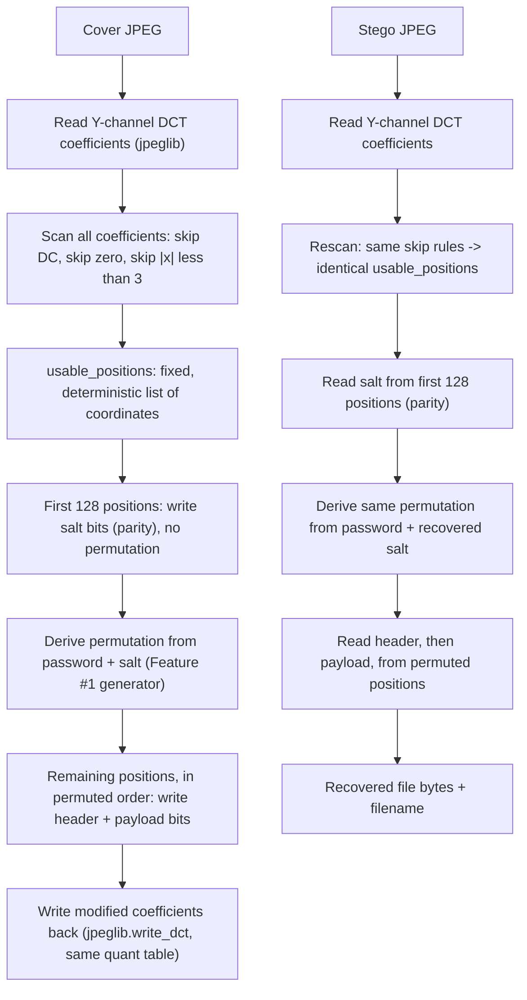
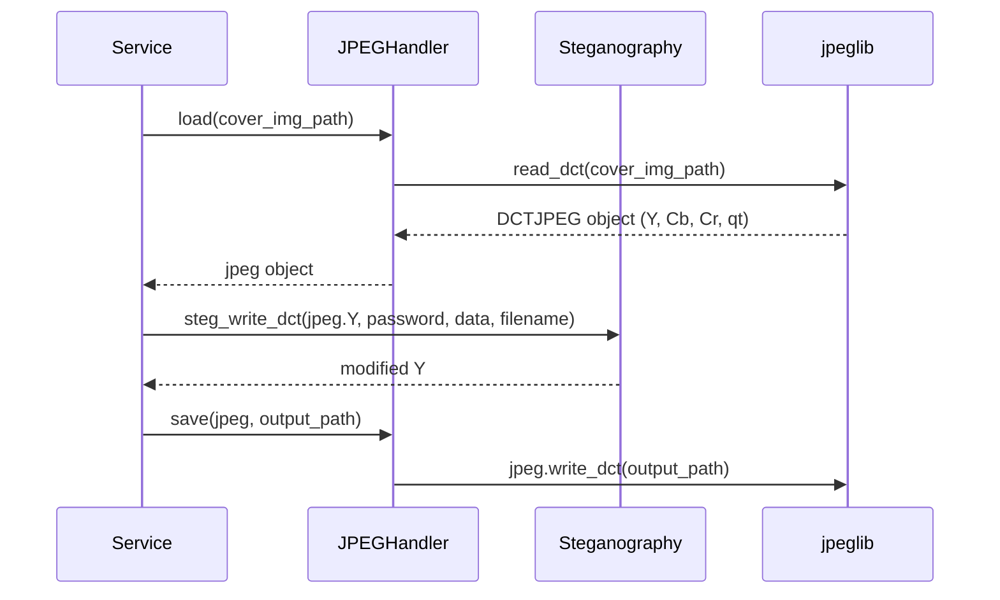

# Feature #3: DCT-Domain Steganography for JPEG Containers

---
## Changelog
| Version   | Date       | Description         | Authors                             |
|-----------|------------|---------------------|-------------------------------------|
| 1.0       | 2026-08-28 | Initial Description | [m000gg](https://github.com/m000gg) |
---

- Issue #... ➔ PR #...

## 👔Part 1: Product & Business

### Executive Summary

`Steganography.steg_write_dct` / `steg_read_dct` extend CamouGG's hiding
mechanism to JPEG containers. PNG's LSB-in-pixel approach (Feature #2) does
not survive JPEG's lossy quantization step, so JPEG requires a different
embedding domain: the **quantized DCT coefficients**, which are the last
point in the JPEG pipeline where values are still ordinary integers, before
lossless entropy coding (Huffman/RLE) packs them into the final file.

The feature reuses the password-and-salt-based permutation generator from
Feature #1 unchanged, and follows the same conceptual structure as Feature
#2 (a fixed, unpermuted salt zone followed by a permuted payload zone), but
the mechanics of reading/writing one bit differ completely: instead of
replacing a bit-plane of an 8-bit pixel channel, one bit is encoded as the
**parity (odd/even) of a signed DCT coefficient**, adjusted by ±1 when it
doesn't already match.

### Feature objectives

- Embed an arbitrary binary file into a JPEG container without the payload
  being destroyed by JPEG's lossy re-compression.
- Reuse the existing password-and-salt permutation mechanism (Feature #1)
  and header format (Feature #2) unchanged, so both container formats share
  the same security properties and on-disk header layout.
- Guarantee that the exact same set of coefficient positions is identified
  as "usable" on both embed and extract, so a correct password always
  recovers the payload and an incorrect one always fails cleanly.
- Dispatch automatically between PNG and JPEG handling based on the
  container file's extension, with no user-facing format selection step.

### Feature scope

**In scope:**
- Reading quantized DCT coefficients (Y channel only) via `jpeglib`.
- Selecting which coefficients are safe to use for embedding.
- Encoding/decoding one payload bit as a coefficient's parity.
- Writing DCT coefficients back to a JPEG file without triggering
  recompression (`jpeglib.write_dct`), preserving the original quantization
  table.
- Extending `Service` to route `.jpg`/`.jpeg` cover images to this feature
  instead of the PNG path.

**Out of scope:**
- Embedding in the Cb/Cr (chrominance) channels — Y only, for this MVP.
- DCT-domain matrix encoding (F5-style minimal-distortion embedding) —
  Jsteg-style parity encoding is used instead.
- Multi-bit-per-coefficient embedding.
- Encryption of the payload content itself (separate crypto module, shared
  with Feature #2 — out of scope here too).
- Any changes to `PayloadIO` — reading/writing the hidden file itself is
  identical regardless of container format.

### User flow



### Use cases

#### 1. Embedding

The user supplies a JPEG cover image, a file, and a password. The image's
Y-channel DCT coefficients are scanned once to build a fixed list of usable
positions. The first 128 of them (unpermuted) carry the salt; the rest,
visited in a password-and-salt-derived order, carry the header and payload,
one bit per coefficient via parity.

#### 2. Successful extraction

The same scan (identical skip rules, same coefficients) is repeated on the
stego image, giving back the same `usable_positions` list. The salt is read
from the first 128 positions without needing the password. The password and
recovered salt reproduce the same permutation used at embed time, so the
header and payload are read from exactly the coefficients they were written
to.

#### 3. Wrong password

The salt zone is read correctly regardless of password. A wrong password
produces a different permutation over the remaining positions, so the
header can't be located/parsed, and extraction fails with the same generic
error used by the PNG path — no partial file is returned.

#### 4. Coefficient value drifts across write and read

If embedding could shrink a coefficient's magnitude (e.g. `3 -> 2`) when
adjusting its parity, a coefficient that qualified as "usable" at embed time
(`abs(x) >= 3`) could fail that same check when the stego image is rescanned
at read time — desynchronizing `usable_positions` between write and read.
This is prevented by always moving a coefficient's value **away from zero**
(e.g. `3 -> 4`, `-3 -> -4`) when its parity needs to change, never toward
it — see Design Decision 3.

#### 5. Small or low-detail cover images

A cover image with little texture (e.g. a flat color) quantizes to mostly
zero AC coefficients, leaving few or no usable positions. If fewer than 128
usable positions exist, embedding is rejected before writing (there isn't
even room for the salt); if there's room for the salt but not the header
and payload, embedding is rejected with a capacity error, the same as an
oversized payload on a PNG container.

### Functional Requirements

- Accept the same `(data: bytes, filename: str, password: str)` inputs as
  the PNG path, and return the same `(data: bytes, filename: str)` shape on
  read.
- Skip the DC coefficient of every 8x8 block unconditionally.
- Skip any coefficient with `abs(value) < 3` (covers zero and ±1/±2).
- Encode one payload bit as a coefficient's parity; adjust by exactly ±1,
  always away from zero, when the current parity doesn't match.
- Build the list of usable coefficient positions identically (same scan
  order, same skip rules) on both write and read, so it never depends on
  values written by a prior embed pass.
- Reserve a fixed, unpermuted block of 128 usable positions for the salt,
  and derive the permutation for the remaining positions from
  `password + salt` via the existing `CSPRNGenerator` (Feature #1),
  restricted to the non-salt position count.
- Reject embedding before writing anything if the payload (header +
  data) does not fit in the available non-salt positions.
- Preserve the original quantization table when writing the modified
  coefficients back to disk.

### Non-Functional Requirements

- Writing a bit must never move a coefficient through zero or change which
  coefficients satisfy the usability threshold — see Design Decision 3.
- The coefficient scan is `O(number of 8x8 blocks x 64)`, run once per
  embed/extract call; acceptable for MVP image sizes.
- Capacity is highly content-dependent (texture-rich images yield far more
  usable coefficients than flat ones) and is not derivable from image
  dimensions alone, unlike the PNG path — it is only known after scanning.
- The feature must not alter `Steganography.steg_write` / `steg_read`
  (the PNG path) or `PayloadIO` in any way; it is purely additive.

## 🛠Part 2: Technical Realisation

### Architecture & Integrations

**Implemented tools**
- `jpeglib` (v1.0.x) — reads/writes raw quantized DCT coefficients via
  libjpeg, without triggering JPEG recompression. `jpeglib.read_dct(path)`
  returns a `DCTJPEG` object exposing `.Y`, `.Cb`, `.Cr`, `.qt` as numpy
  arrays; `Y` has shape `(num_block_rows, num_block_cols, 8, 8)` — no
  separate leading channel axis, unlike Cb/Cr which are addressed
  separately. Writing is done via `jpeg.write_dct(output_path)` on the same
  object used for reading, which flushes whatever the caller mutated on
  `jpeg.Y` in place.
- `numpy` — coefficient scanning, bit packing/unpacking for the salt
  (same `np.packbits`/manual bit-list approach as Feature #2).
- The existing `CSPRNGenerator` (Feature #1) — reused without modification.

**Module layout (extends the layout from Feature #2)**
```
core/
  steganography.py    <- adds steg_write_dct / steg_read_dct
formats/
  jpeg_handler.py       <- JPEGHandler: load / save, the only module
                         that imports jpeglib
core/
  service.py            <- Service: dispatches to PNGHandler+steg_write
                         or JPEGHandler+steg_write_dct based on file
                         extension
```

**Sequence (embed)**


### Explanation of the design decisions

#### 1. Coefficient selection: skip DC, skip zero, threshold at `abs >= 3`

For every 8x8 block, the coefficient at position `(0, 0)` (DC — the block's
average value) is always skipped: modifying it produces visible blockiness,
unlike a single AC coefficient. Zero-valued AC coefficients are skipped
because JPEG's entropy coding relies on runs of zeros; turning a zero into
±1 disrupts that and is easy to detect statistically. The threshold is set
at `abs(coefficient) >= 3`, not `>= 2` — see Decision 3 for why 2 is not
safe.

The illustration below shows one 8x8 quantized block: the DC cell, the
mostly-zero cells, and the handful of coefficients that actually qualify
for embedding.


Out of the 64 coefficients in a typical block, only 2-3 are usable — this
is why JPEG capacity is much lower per pixel than PNG's, and why capacity
cannot be estimated from image dimensions alone (Non-Functional
Requirements).

#### 2. Encoding a bit as parity

A coefficient's parity (`abs(value) % 2`) directly represents one bit: even
means `0`, odd means `1`. If the current parity already matches the desired
bit, nothing is written. If not, the coefficient is adjusted by exactly ±1
to flip its parity. This is the classic Jsteg-style approach — simpler and
more statistically detectable than F5's matrix encoding, which was judged
out of scope for this MVP.

#### 3. Adjustments always move away from zero, never toward it

Given a mismatch, an F5-style implementation would decrease the
coefficient's magnitude (moving toward zero) to minimize visual distortion.
This project does the opposite: **magnitude is always increased** (`3 -> 4`,
`-3 -> -4`), regardless of which bit is being written.

The reason is structural, not stylistic: `usable_positions` is computed by
scanning the coefficient array fresh on both write and read, using the same
`abs(coefficient) >= 3` rule. If an adjustment were allowed to shrink a
coefficient (e.g. `3 -> 2`), a position that qualified as usable when it was
scanned before writing could fail that same test when the stego file is
rescanned during extraction — silently desynchronizing the position list
between write and read, corrupting every bit read after that point. Moving
only away from zero guarantees magnitude never decreases, so anything that
passed the threshold once will always pass it again. The trade-off is
slightly more distortion per changed coefficient than a toward-zero
strategy — an acceptable cost for MVP correctness.

#### 4. Salt zone and permutation reuse (Feature #1)

The first 128 positions of `usable_positions` (128 bits = 16 bytes of
salt, one bit per coefficient) are written/read in plain scan order,
unpermuted — the same rationale as Feature #2's 44-pixel salt zone: the
salt must be locatable before a password-derived permutation can be
computed at all. The remaining positions are permuted via
`CSPRNGenerator.hash_password(password, len(usable_positions) - 128, salt)`,
called exactly as it is for PNG — the generator has no awareness of what
kind of "slot" it is permuting.

#### 5. Header format unchanged

The same `<payload_length|filename>` textual header from Feature #2 is
reused verbatim — it is encoded as UTF-8 bytes and its bits are written
through the same parity mechanism as the payload, with no format-specific
changes.

#### 6. `JPEGHandler` mirrors `PNGHandler`'s contract, adapted to `jpeglib`'s object-oriented API

`load()` returns the `DCTJPEG` object obtained from `jpeglib.read_dct()`;
`save()` calls `jpeg.write_dct(output_path)` on that same object after
`Service` has set `jpeg.Y` to the modified array. Unlike `PNGHandler`,
there is no separate "shape" to track — `jpeglib`'s object already retains
everything needed to reconstruct a valid file. `Steganography.steg_write_dct`
/ `steg_read_dct` only ever see the raw `Y` array, never the `DCTJPEG`
object itself, keeping the core logic decoupled from `jpeglib` the same way
it is decoupled from Pillow on the PNG path.

#### 7. Format dispatch lives in `Service`, not the TUI

`Service` inspects the cover image's file extension (`.jpg`/`.jpeg` vs.
anything else) and picks `JPEGHandler` + `steg_write_dct`/`steg_read_dct`,
or `PNGHandler` + `steg_write`/`steg_read`, accordingly. The TUI is
unaffected — it already only passes file paths to `Service.embed_file` /
`Service.extract_file`, exactly as it does for PNG.

### Data models

This feature does not create any persistent data or database models.

**`Steganography.steg_write_dct` / `steg_read_dct`:**
- In: `Y: np.ndarray` (shape `(block_rows, block_cols, 8, 8)`, `int16`),
  `password: str`, `data: bytes`, `filename: str`
- Out: modified `Y: np.ndarray` (write) / `(data: bytes, filename: str)`
  (read)

**`JPEGHandler.load` / `save`:**
- In: `img_path: str` (load) / `jpeg: DCTJPEG, output_path: str` (save)
- Out: `jpeg: DCTJPEG` (load) / `None` (save)

### API

N/A — this feature has no HTTP API. It is exposed exclusively through
`Service.embed_file` / `Service.extract_file` (shared with the PNG path),
which the TUI calls directly.

### Open questions

- *Q1*: Cb/Cr (chrominance) coefficients are never used for embedding in
  this MVP. Would splitting some payload capacity across chrominance
  channels meaningfully increase capacity, and is it worth the added
  complexity of chroma subsampling's smaller coefficient grid?
- *Q2*: Capacity depends entirely on image content (a flat-color JPEG may
  have far fewer than 128 usable coefficients). Should `Service` or the TUI
  surface an early, content-aware capacity estimate before the user
  commits to a payload, rather than only failing at write time?
- *Q3*: Corrupted-header test coverage exists for the PNG path (flipping
  bits in the fixed salt zone) but not yet for JPEG — what is the
  equivalent safe corruption to simulate for a DCT-domain container without
  accidentally producing an invalid JPEG file that `jpeglib` can't even
  load?
- *Q4*: Robustness to re-compression (e.g. if a stego JPEG is re-saved by
  another tool, or transmitted through a service that re-encodes JPEGs) has
  not been tested. Any further lossy processing after embedding will
  destroy the hidden data — should this constraint be documented
  user-facing, not just here?