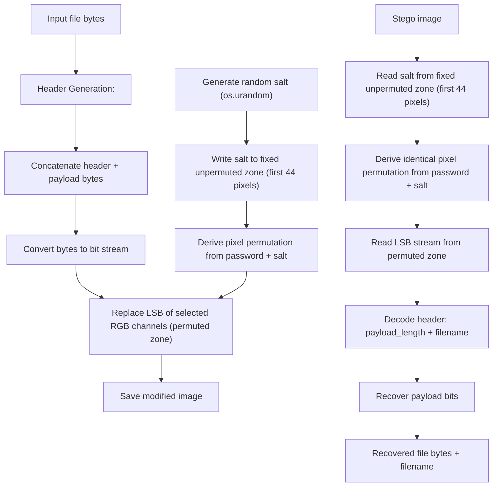
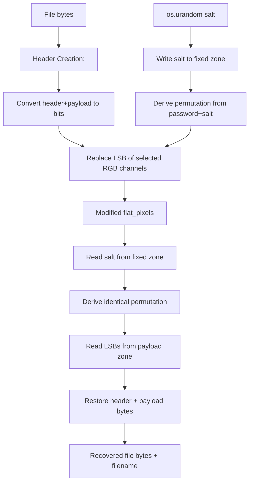

# Feature #2: Least Significant Bit (LSB) Embedding

---
## Changelog

| Version   | Date       | Description                                                                                                                                                                                                                                                          | Authors                             |
|-----------|------------|----------------------------------------------------------------------------------------------------------------------------------------------------------------------------------------------------------------------------------------------------------------------|-------------------------------------|
| 1.0       | 2026-08-03 | Initial Description                                                                                                                                                                                                                                                  | [m000gg](https://github.com/m000gg) |
| 1.1       | 2026-08-04 | Fixed header example, clarified header decoding vs vectorized message decoding                                                                                                                                                                                       | [m000gg](https://github.com/m000gg) |
| 2.0       | 2026-08-14 | MVP2: random per-embed salt with a fixed unpermuted salt zone, arbitrary-file (bytes) payload instead of UTF-8-only text, extended header with filename                                                                                                              | [m000gg](https://github.com/m000gg) |
| 2.1       | 2026-08-21 | Layered the implementation: `PNGHandler` (formats/) now owns all Pillow/NumPy image I/O, `PayloadIO` (core/) owns payload-file I/O, `Service` (core/) orchestrates both around the now format-agnostic `steg_write`/`steg_read`. TUI updated to call `Service` only. | [m000gg](https://github.com/m000gg) |

---

- Issue #6 ➔ PR #8

# 👔 Part 1: Product & Business

## Executive Summary

`LSBEncoder` provides the core steganographic mechanism used by CamouGG for hiding
arbitrary files inside an image.

Instead of modifying the visual appearance of the image, the algorithm changes only
the **Least Significant Bit (LSB)** of selected RGB color channels. Since modifying
the least significant bit changes the color value by at most one intensity level,
the alteration is practically invisible to the human eye while still allowing
deterministic recovery of the embedded payload.

The container is split into two zones: a small **fixed, unpermuted salt zone** at
the start of the image, and a **permuted payload zone** covering the rest. The salt
zone stores a randomly generated, per-embed salt in plain raster order — this is
the only piece of data whose location does not depend on the password. The salt is
what makes the pixel permutation (see Feature #1) different on every embed, even
when the same password is reused on the same container.

As of v2.1, the encoding/decoding logic itself (`steg_write`/`steg_read`) is
**format-agnostic**: it operates purely on an in-memory flat pixel array and no
longer touches disk, Pillow, or any PNG-specific detail. All image I/O has moved to
`PNGHandler`, and all payload-file I/O has moved to `PayloadIO`. A thin `Service`
layer wires the three together so callers (the TUI, and any future CLI) never
touch pixels or bytes directly — see Design Decision 12.

## Feature objectives

- Embed an arbitrary binary file (not just UTF-8 text) into RGB images, byte-for-byte.
- Generate a new random salt on every embed and store it in a fixed, unpermuted zone
  so two embeds with the same password never produce identical output.
- Preserve visual quality by modifying only one bit per color channel.
- Recover the original file, and its original filename, without any information loss.
- Work deterministically together with the password-and-salt-based pixel permutation.
- Keep the encoding/decoding core independent of the container format, so a future
  JPEG handler can reuse it without modification.

## Feature scope

### In scope

- Converting an arbitrary file's bytes into a bit stream.
- Generating a random salt per embed and writing it to a fixed, unpermuted zone.
- Embedding bits into the least significant bits of RGB values.
- Restoring bytes from extracted LSBs.
- Reading and writing message headers, including payload length and filename.
- Capacity validation (salt zone + header + payload against container size).
- Orchestrating payload-file I/O, image I/O, and the encode/decode core into a
  single call each for embedding and extraction (`Service`).

### Out of scope

- Selecting embedding locations within the payload zone (handled by Feature #1).
- PNG-specific image loading/saving (handled by `PNGHandler`, see Decision 1).
- Reading/writing the payload file to disk (handled by `PayloadIO`, see Decision 12).
- Password-to-key derivation (handled by Feature #1).
- Encryption of the payload content itself (separate crypto module).
- JPEG/DCT-domain embedding (separate feature — `formats/jpeg_handler.py` will sit
  alongside `PNGHandler` behind the same load/save contract).

## User flow



## Use cases

### 1. Embedding

The user supplies a file (bytes) and a password.

A fresh random salt is generated and written to the fixed salt zone, in plain
raster order, without any password-derived permutation.

The password and salt together determine the pixel order for the rest of the
container (Feature #1).

The LSB encoder embeds every header bit and every payload bit into the least
significant bit of one RGB channel, within the permuted zone.

### 2. Successful extraction

The salt is read directly from the fixed zone — no password is needed for this step.

The same password, combined with that salt, generates the identical pixel
permutation for the payload zone.

The encoder reads the same LSB sequence, reconstructs the original header and
payload bytes, and returns the original filename and file content.

### 3. Wrong password

The salt zone is read correctly regardless of the password (it isn't permuted).

A wrong password produces a different derived permutation for the payload zone, so
LSBs are read in the wrong order.

The reconstructed byte stream becomes random noise, preventing successful header
parsing or payload recovery. This surfaces as a generic error when the header
terminator cannot be located/parsed, or when the declared payload length exceeds
what is available — no partial file is returned.

### 4. Same password, same container, repeated embed

Because a new random salt is generated on every embed, the derived key and pixel
permutation differ between embeds even when the password and source image are
identical. Two embeds of the same file with the same password therefore produce
different stego images.

### 5. Capacity overflow

If the container is smaller than the fixed salt zone, embedding is rejected
immediately.

If the header (payload length + filename) plus the payload requires more bits than
available in the remaining (permuted) zone, embedding is aborted before modifying
the image.

The same validation is performed on the read path: if the declared payload length
in the header exceeds the remaining available bits, extraction is aborted with an
error instead of returning corrupted data.

### 6. End-to-end via the TUI (new in v2.1)

The user picks Write or Read mode. For Write, the TUI collects the cover image
path, the file to hide, the password, and an output image path (custom or same
directory as the cover image), then calls `Service.embed_file(...)` once. For
Read, the TUI collects the stego image path, the password, and an output
*directory* (custom or same directory as the stego image), then calls
`Service.extract_file(...)` once. The TUI never touches pixel arrays, byte
buffers, or the header format directly — it only passes file paths and a
password, and displays the resulting output path or any raised error.

## Functional Requirements

- Accept an arbitrary binary payload (`bytes`), not only UTF-8 text.
- Generate a new random salt (`os.urandom(16)`) on every embed call.
- Write the salt to a fixed, unpermuted zone at the start of the container, in
  plain raster order.
- Read the salt back automatically on extract, without any manual input.
- Derive the pixel permutation for the payload zone from `password + salt`,
  restricted to the pixel range outside the salt zone.
- Convert the header and payload into a bit stream.
- Embed one payload bit into one RGB channel, within the payload zone only.
- Support arbitrary image dimensions above the minimum required by the salt zone.
- Recover the original payload bytes and filename exactly.
- Detect payloads exceeding available capacity, both during embedding and
  extraction, before any partial data is written or returned.
- Preserve all bits except the least significant one.
- Accept and return only in-memory flat pixel arrays at the encode/decode core —
  all disk I/O (image and payload file) happens outside of it.

## Non-Functional Requirements

- Image distortion must remain visually imperceptible.
- Memory usage should scale linearly with payload size.
- The implementation must operate deterministically given the same password, salt,
  and container.
- Time complexity: message body decoding is a single vectorized NumPy operation
  (O(n) over bits, no Python-level loop). Header decoding is performed byte-by-byte
  in a Python loop, since the header's own length is not known in advance; this
  loop is bounded by the number of pixels in the payload zone in the worst case
  (e.g. wrong password with no `>` terminator found).
- Salt-zone encoding/decoding is a fixed-cost operation independent of payload
  size (constant 44-pixel zone).
- The encode/decode core (`Steganography.steg_write`/`steg_read`) must remain
  container-format-agnostic, so that adding JPEG support requires only a new
  handler implementing the same load/save contract as `PNGHandler`, with no
  changes to `steg_write`/`steg_read` themselves.

# 🛠 Part 2: Technical Realisation

## Architecture & Integrations

**Tools used**

- Pillow — image loading/saving (isolated inside `PNGHandler`).
- NumPy — vectorized manipulation of RGB arrays.
- `os.urandom` — cryptographically secure salt generation.
- UTF-8 encoding/decoding (header only — see Design Decision 6).
- Password-and-salt-based permutation generator (Feature #1).

**Module layout**

```
core/
  steganography.py    ← steg_write / steg_read: pure LSB/salt/header logic,
                         operates on flat_pixels in/out, no disk access
  payload_io.py        ← PayloadIO: read_payload / write_payload,
                         reads/writes the *hidden* file on disk
  service.py            ← Service: orchestrates PayloadIO + PNGHandler + Steganography
                         into embed_file / extract_file
formats/
  png_handler.py         ← PNGHandler: load / save / get_num_pixels,
                         the only module that imports Pillow
tui/
  photo_stego_screen.py  ← collects paths/password, calls Service only
```

## Explanation of the design decisions

### 1. Image I/O isolated in `PNGHandler`

```python
class PNGHandler:
    def load(self, img_path) -> tuple[np.ndarray, tuple]:
        ...  # Image.open, .convert("RGB"), np.array, reshape(-1, 3)
        return flat_pixels, original_shape

    def save(self, flat_pixels, original_shape, output_path) -> None:
        ...  # reshape back, Image.fromarray, .save

    def get_num_pixels(self, filepath) -> int:
        ...
```

All Pillow/NumPy-shape-specific work — opening the file, converting to RGB,
flattening to `(num_pixels, 3)`, and the reverse on save — lives here, together
with the file-not-found/invalid-image error handling that used to live inside
`steg_write`. This is what makes `steg_write`/`steg_read` container-agnostic: they
never call `Image.open` or know about `.png` at all.

---

### 2. Encode/decode core takes and returns `flat_pixels`, not paths

```python
def steg_write(self, flat_pixels, password, data, filename) -> np.ndarray: ...
def steg_read(self, flat_pixels, password) -> tuple[bytes, str]: ...
```

`steg_write` mutates and returns `flat_pixels` directly (no `Image.save` call
inside it); `steg_read` takes an already-loaded `flat_pixels` and returns the
recovered `(data, filename)`. Neither function knows how `flat_pixels` was
produced or where the result will be written — that is the caller's job. This is
the same contract for both PNG today and JPEG later: any handler that can produce
a `(flat_pixels, original_shape)` pair and consume a `flat_pixels` array back can
be swapped in without touching this file.

---

### 3. Fixed salt zone (first 44 pixels)

```python
salt_pixels = flat_pixels[:44]
```

A new 16-byte salt (`os.urandom(16)`) is generated on every embed. At 3 usable LSB
slots per pixel (one per RGB channel), 128 bits of salt require 44 pixels
(`ceil(128 / 3) = 43`, rounded up to a whole-pixel boundary to keep the zone simple
and avoid partially-used pixels). The last 4 of the 132 available slots in this
zone are unused.

This zone is **not** permuted — it is written and read in plain raster order
(`flat_pixels[:44]`), independent of the password. This is a deliberate design
choice, not an oversight: the permutation for the rest of the container is derived
*from* the salt, so the salt cannot itself live inside the permuted space without
creating a circular dependency (you would need the salt to find the salt).

Only the LSB (bit-plane 0) of each channel in this zone is modified — the same
"decompose into 8 bit-planes, replace plane 0, recompose" approach used for the
payload zone (see Decision 7).

---

### 4. Deriving the payload-zone permutation from password + salt

```python
num_pixels = flat_pixels.shape[0]
prp = self.generator.hash_password(password, num_pixels - 44, salt)
prp_shifted = [i + 44 for i in prp]
```

The permutation generator (Feature #1) is called with a restricted pixel count
(`num_pixels - 44`), so it can never produce an index that falls inside the salt
zone. The returned indices (range `[0, num_pixels - 45]`) are then shifted by `+44`
to map them onto the actual payload-zone pixel range (`[44, num_pixels - 1]`).
Because the domain is restricted *before* generation (not filtered *after*), a
collision with the salt zone is structurally impossible, not merely unlikely.

`num_pixels` is derived from `flat_pixels.shape[0]` directly — since v2.1 there is
no `img_path` in scope inside `steg_write`/`steg_read` to call `get_num_pixels` on.

On read, the same salt (recovered from the fixed zone) and the same password
reproduce the identical `prp_shifted`, so header and payload are read from exactly
the pixels they were written to.

On write, only `ceil(payload_bits / 3)` pixels are actually consumed from
`prp_shifted` (`prp_shifted[:num_pixels_needed]`) — matching the true 3-bits-per-
pixel capacity used by the capacity check in Decision 9, rather than reserving one
pixel per bit.

---

### 5. Header generation

Before embedding, the payload receives a textual header:

```
<payload_length|filename>
```

Example:

```
<45231|report_final.pdf>10110011...
```

- `payload_length` — the number of payload bytes that follow, so extraction knows
  exactly how many bits to read.
- `filename` — the original file's full name including extension, so the original
  file name is preserved on extraction rather than replaced with a generic output
  name.

The header itself is composed only of ASCII digits, `<`, `>`, `|`, and filename
characters — it is always valid UTF-8, so it can safely continue to be decoded as
text. This is unrelated to, and unaffected by, the payload no longer being
UTF-8-safe (see Decision 6).

---

### 6. Header stays text; payload becomes raw bytes

The header is still encoded as UTF-8 text (see Decision 5) — that part of the
design does not change from v1.

The payload, however, is treated as raw `bytes` end-to-end and is **never**
passed through `.decode("utf-8", errors="replace")`. For arbitrary files, the byte
stream is not guaranteed to be valid UTF-8 at all — decoding it with
`errors="replace"` would silently substitute a placeholder character for any byte
sequence that isn't valid UTF-8, corrupting the payload irrecoverably and breaking
byte-for-byte round-trip. The payload is therefore returned as `bytes` directly
from the reconstructed channel values, with no text decoding step.

---

### 7. Byte-to-bit conversion

Each byte (from the header and from the payload) is decomposed into eight
individual bits, e.g. `01000001` becomes `0 1 0 0 0 0 0 1`. These bits form the
stream embedded into the payload zone of the image.

---

### 8. Least Significant Bit replacement

For every selected RGB channel in the payload zone, only the least significant bit
is replaced — e.g. `10101100` embedding a `1` becomes `10101101`. Every channel
therefore changes by at most `±1`, which is visually imperceptible. This is
identical to how the salt zone is written (Decision 3), just applied to a
different pixel range with a different index source (`prp_shifted` instead of
plain raster order).

---

### 9. Capacity validation

Before modifying the pixel array, the encoder verifies, in this order:

1. `num_pixels >= 44` — the container is large enough to even hold the salt zone.
2. `(header_bits + payload_bits) <= (num_pixels - 44) * 3` — the header plus
   payload fit within the remaining payload-zone capacity.

Both checks happen **before** the (comparatively expensive) permutation is
generated, so an oversized payload is rejected immediately rather than after
paying the cost of `hash_password`. This prevents incomplete writes and corrupted
payloads.

The same validation is performed on the read path, both while searching for the
header terminator and after the header is decoded, to prevent reading past the end
of the available bitstream.

---

### 10. Reconstruction

`steg_write` mutates the salt-zone and payload-zone slices of `flat_pixels`
in place and returns it. Reshaping the flat array back into `height × width × RGB`
and writing it as an image file is `PNGHandler.save`'s responsibility, not this
function's — see Decision 1.

---

### 11. Extraction

Extraction performs the reverse process on an already-loaded `flat_pixels`:

1. Read the salt from the fixed zone (`flat_pixels[:44]`), no password required
   for this step.
2. Derive the identical payload-zone permutation from `password + salt`.
3. Read the LSB of every selected channel in the payload zone sequentially and
   flatten into a single bitstream.
4. Decode the header one byte at a time until the `>` terminator is found, since
   the header's own length is not known ahead of time; split on `|` to recover
   `payload_length` and `filename` separately.
5. Once the header is parsed, the payload length becomes known, and the remaining
   payload bits are decoded in a single vectorized step: the bitstream is reshaped
   into `(payload_length, 8)` and converted to byte values via a dot product with
   bit weights `[1, 2, 4, 8, 16, 32, 64, 128]`.
6. Return the raw payload `bytes` (no UTF-8 decoding — see Decision 6) together
   with the recovered `filename`. Writing these bytes out as a file on disk is
   `PayloadIO.write_payload`'s responsibility — see Decision 12.

---

### 12. Orchestration: `PayloadIO` and `Service` (new in v2.1)

```python
class PayloadIO:
    def read_payload(self, path) -> tuple[bytes, str]:
        ...  # open(path, "rb").read() + os.path.basename(path)

    def write_payload(self, data, filename, output_dir) -> str:
        ...  # writes data to output_dir/filename, returns the full path

class Service:
    def __init__(self):
        self.payload_io = PayloadIO()
        self.steganography = Steganography()
        self.png_handler = PNGHandler()

    def embed_file(self, cover_img_path, payload_path, password, output_path):
        data, filename = self.payload_io.read_payload(payload_path)
        flat_pixels, original_shape = self.png_handler.load(cover_img_path)
        modified = self.steganography.steg_write(flat_pixels, password, data, filename)
        self.png_handler.save(modified, original_shape, output_path)

    def extract_file(self, img_path, password, output_dir):
        flat_pixels, original_shape = self.png_handler.load(img_path)
        data, filename = self.steganography.steg_read(flat_pixels, password)
        return self.payload_io.write_payload(data, filename, output_dir)
```

`PayloadIO` is the mirror of `PNGHandler`, but for the file being hidden rather
than the container: `read_payload` turns a path into `(bytes, filename)` before
`steg_write`; `write_payload` turns `steg_read`'s returned `(bytes, filename)` back
into a real file on disk after extraction. Neither function is container-format
aware.

`Service` is a thin orchestration layer with no domain logic of its own — it only
sequences calls to the other three components and passes data between them. This
is what the TUI (and any future CLI entry point) calls; nothing outside `Service`
needs to know that `flat_pixels`, salts, or permutations exist at all.



## Data models

This feature does not create any persistent data or database models.

**`Steganography.steg_write` / `steg_read`** (core, format-agnostic):

- In: `flat_pixels: np.ndarray`, `password: str`, `data: bytes`, `filename: str`
- Out: modified `flat_pixels: np.ndarray` (write) / `(data: bytes, filename: str)` (read)

**`PNGHandler.load` / `save`**:

- In: `img_path: str` (load) / `flat_pixels, original_shape, output_path` (save)
- Out: `(flat_pixels, original_shape)` (load) / `None` (save)

**`PayloadIO.read_payload` / `write_payload`**:

- In: `path: str` (read) / `data: bytes, filename: str, output_dir: str` (write)
- Out: `(data: bytes, filename: str)` (read) / `output_path: str` (write)

**`Service.embed_file` / `extract_file`** (what the TUI calls):

- In: `cover_img_path, payload_path, password, output_path` (embed) /
  `img_path, password, output_dir` (extract)
- Out: `None` (embed — result is the file at `output_path`) /
  `saved_file_path: str` (extract)

## Open questions

### Q1 (resolved in v2.0)

> The current implementation stores the payload length as a textual header
> (`<123>`). Would a fixed-size binary header reduce overhead while simplifying
> parsing?

Kept textual for MVP2 (`<payload_length|filename>`) — the header is small relative
to typical payloads, and text parsing is already implemented and tested. A
fixed-size binary header remains an option for a future revision if header
overhead becomes a measured concern.

### Q2

The current implementation modifies one bit per RGB channel. Should future
versions optionally support using multiple least significant bits (2-LSB, 3-LSB)
to increase embedding capacity while accepting greater visual distortion?

*(Out of scope for MVP2 — explicitly deferred.)*

### Q3 (resolved in v2.1)

> The write path currently instantiates its own generator locally
> (`generator = CSPRNGenerator()`), while the read path accesses it via
> `self.generator`. Should generator ownership be unified — e.g. always injected via
> `__init__` — to keep write and read symmetric within the same class?

Resolved as part of the v2.1 refactor: `steg_write` and `steg_read` are methods on
the same `Steganography` instance and both use `self.generator`, injected once via
`__init__`. There is no longer a locally-instantiated generator on the write path.

### Q4

The salt zone is fixed at 44 pixels regardless of container size. For very small
containers, this represents a proportionally larger fixed cost. Should the minimum
supported container size be explicitly documented/enforced elsewhere (e.g. in the
TUI or `Service`), rather than only surfacing as a capacity error at write time?

*(Still open — `Service`/TUI currently only surface the existing `num_pixels < 44`
error from `steg_write`; no explicit minimum-size guidance is shown up front.)*