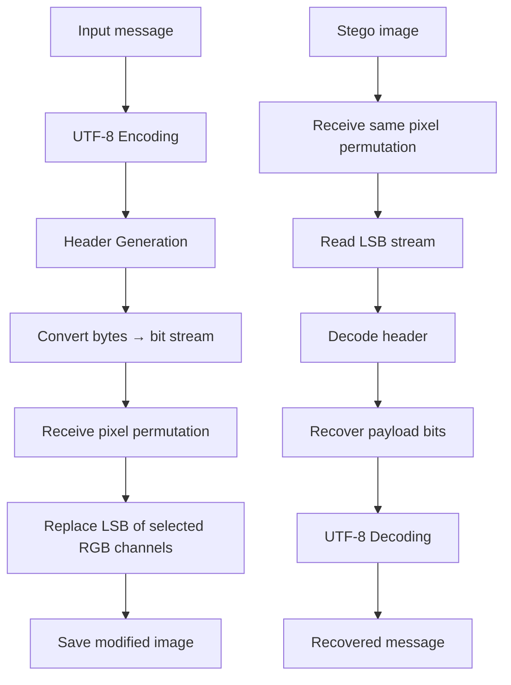
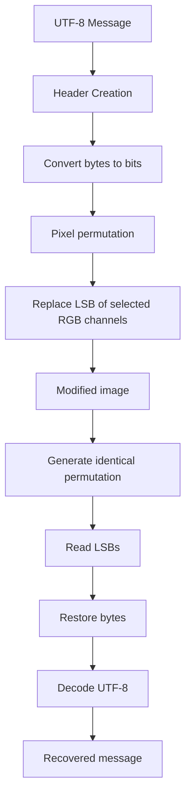

# Feature #2: Least Significant Bit (LSB) Embedding

---
## Changelog

| Version   | Date       | Description                                                                    | Authors                             |
|-----------|------------|--------------------------------------------------------------------------------|-------------------------------------|
| 1.0       | 2026-08-03 | Initial Description                                                            | [m000gg](https://github.com/m000gg) |
| 1.1       | 2026-08-04 | Fixed header example, clarified header decoding vs vectorized message decoding | [m000gg](https://github.com/m000gg) |

---

- Issue #3➔ PR #2

# 👔Part 1: Product & Business

## Executive Summary

`LSBEncoder` provides the core steganographic mechanism used by CamouGG for hiding
arbitrary text inside an image.

Instead of modifying the visual appearance of the image, the algorithm changes only
the **Least Significant Bit (LSB)** of selected RGB color channels. Since modifying
the least significant bit changes the color value by at most one intensity level,
the alteration is practically invisible to the human eye while still allowing
deterministic recovery of the embedded payload.

The actual order of modified pixels is **not** decided by this feature. Instead,
pixel traversal order is provided externally by the cryptographic permutation
generator (see Feature #1).

## Feature objectives

- Embed arbitrary UTF-8 text into RGB images.
- Preserve visual quality by modifying only one bit per color channel.
- Recover the original payload without any information loss.
- Work deterministically together with the password-based pixel permutation.

## Feature scope

### In scope

- Converting text into a stream of bits.
- Embedding bits into the least significant bits of RGB values.
- Restoring bytes from extracted LSBs.
- Reading and writing message headers.
- Capacity validation.

### Out of scope

- Selecting embedding locations (handled by Feature #1).
- Image loading/saving.
- Password processing.
- Encryption of the payload itself.

## User flow



## Use cases

### 1. Embedding

The user supplies a message and password.

The password determines the pixel order (Feature #1).

The LSB encoder embeds every message bit into the least significant bit of one RGB
channel.

### 2. Successful extraction

The same password generates the identical pixel permutation.

The encoder reads the same LSB sequence, reconstructs the original bytes and
returns the original message.

### 3. Wrong password

A different permutation causes LSBs to be read in the wrong order.

The reconstructed byte stream becomes random noise, preventing successful message
recovery. In the current implementation, this failure surfaces as a `ValueError`
when the header cannot be located or parsed, or when the required number of bits
exceeds what is available in the image.

### 4. Capacity overflow

If the payload requires more bits than available RGB channels, embedding is aborted
before modifying the image. The same check is performed symmetrically during
extraction: if the declared message length in the header exceeds the remaining
available bits, extraction is aborted with an error instead of returning corrupted
data.

## Functional Requirements

- Accept an arbitrary UTF-8 string.
- Convert it into a bit stream.
- Embed one payload bit into one RGB channel.
- Support arbitrary image dimensions.
- Recover the original payload exactly.
- Detect messages exceeding image capacity, both during embedding and extraction.
- Preserve all bits except the least significant one.

## Non-Functional Requirements

- Image distortion must remain visually imperceptible.
- Memory usage should scale linearly with payload size.
- The implementation must operate deterministically.
- Time complexity: message body decoding is a single vectorized NumPy
  operation (O(n) over bits, no Python-level loop). Header decoding is performed
  byte-by-byte in a Python loop, since the header length is not known in advance;
  this loop is bounded by the number of pixels in the image in the worst case
  (e.g. wrong password with no `>` terminator found).

# 🛠Part 2: Technical Realisation

## Architecture & Integrations

**Tools used**

- Pillow — image loading/saving.
- NumPy — vectorized manipulation of RGB arrays.
- UTF-8 encoding/decoding.
- Password-based permutation generator (Feature #1).

## Explanation of the design decisions

### 1. Image conversion to RGB

```python
img.convert("RGB")
```

The embedding algorithm always operates on RGB images regardless of the original
image mode.

This guarantees that every pixel consists of exactly three independent 8-bit color
channels.

---

### 2. Image represented as a NumPy array

```python
pixel_array = np.array(img_rgb)
```

The image becomes a three-dimensional matrix

```
height × width × RGB
```

instead of individual Pillow pixel objects.

This allows vectorized operations that are significantly faster than iterating over
every pixel in Python.

---

### 3. Flattening the image

```python
reshape(-1, 3)
```

Internally the image is transformed into

```
number_of_pixels × RGB
```

This simplifies indexing because every pixel now has a single integer index,
matching the permutation generated by Feature #1.

---

### 4. Header generation

Before embedding, the payload receives a header

```
<message_length>
```

Example

```
<19>Hello from CamouGG
```

The header stores the payload length so that extraction knows exactly how many bits
must be read.

Without this information extraction would have no deterministic stopping point.

---

### 5. UTF-8 encoding

The complete payload (header + message) is encoded using UTF-8.

UTF-8 was selected because it supports arbitrary Unicode characters while remaining
fully backward compatible with ASCII.

---

### 6. Byte-to-bit conversion

Each byte is decomposed into eight individual bits.

Conceptually,

```
01000001
```

becomes

```
0 1 0 0 0 0 0 1
```

These bits form the payload stream embedded into the image.

---

### 7. Least Significant Bit replacement

For every selected RGB channel

```
Original byte

10101100
```

Embedding bit

```
1
```

produces

```
10101101
```

Only the least significant bit changes.

Therefore every channel changes by at most

```
±1
```

which is visually imperceptible.

---

### 8. Capacity validation

Before modifying the image, the encoder verifies

```
required_bits ≤ available_RGB_channels
```

If the payload does not fit, embedding is aborted immediately.

This prevents incomplete writes and corrupted payloads.

The same validation is performed on the read path, both while searching for the
header terminator and after the header is decoded, to prevent reading past the end
of the available bitstream.

---

### 9. Reconstruction

After modifying the selected channels,

the modified pixel array is reshaped back into its original dimensions

```
number_of_pixels × RGB

↓

height × width × RGB
```

and written as a new image.

---

### 10. Extraction

Extraction performs the reverse process.

The identical pixel permutation is generated.

The least significant bit of every selected channel is read sequentially and
flattened into a single bitstream.

The header is decoded one byte at a time (8 bits per iteration) until the `>`
terminator is found, since the header's own length is not known ahead of time.

Once the header is parsed, the payload length becomes known, and the remaining
message bits are decoded in a single vectorized step: the bitstream is reshaped
into `(num_chars, 8)` and converted to byte values via a dot product with bit
weights `[1, 2, 4, 8, 16, 32, 64, 128]`, rather than looping character by character.

Finally,

```
bits

↓

bytes

↓

UTF-8 string
```

produces the original hidden message.



## Data models

This feature does not create any persistent data or database models.

Input:

- `message: str`
- `pixel_indices: list[int]`
- RGB image

Output:

- Modified RGB image after embedding.
- Original UTF-8 string after extraction.

## Open questions

### Q1

The current implementation stores the payload length as a textual header (`<123>`).

Would a fixed-size binary header (for example a 32-bit unsigned integer) reduce
overhead while simplifying parsing?

### Q2

The current implementation modifies one bit per RGB channel.

Should future versions optionally support using multiple least significant bits
(2-LSB, 3-LSB) to increase embedding capacity while accepting greater visual
distortion?

### Q3

The write path (`steg_write2`) currently instantiates its own generator locally
(`generator = CSPRNGenerator()`), while the read path (`steg_read`) accesses it via
`self.generator`. Should generator ownership be unified — e.g. always injected via
`__init__` — to keep write and read symmetric within the same class?